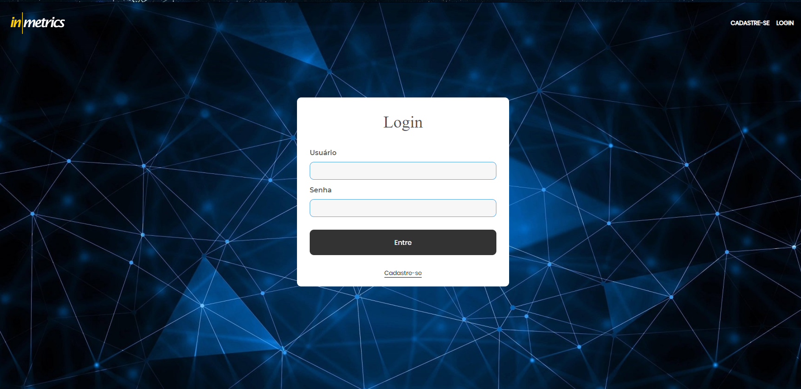

# Desafio Inmetrics Qualidade de Software
> Desafio de automação de testes para avaliar a construção e uso de boas práticas. 


[![Build Status][travis-image]][travis-url]
  
![selenium-image]
![ruby-image][ruby-url]  
![cucumber-image]
![capibara-image]
![rspec-image]  

Projeto de automação de testes para os recursos da plataforma de exemplo da Inmetrics, 
Mapeados o cadastro de um novo usuário, o login deste usuário no sistema e o cadastro de um novo funcionário.



## Instalação

Windows:

```sh
edit autoexec.bat
```

## Exemplo de uso

Alguns exemplos interessantes e úteis sobre como seu projeto pode ser utilizado. Adicione blocos de códigos e, se necessário, screenshots.

_Para mais exemplos, consulte a [Wiki][wiki]._ 

## Configuração para Desenvolvimento

Descreva como instalar todas as dependências para desenvolvimento e como rodar um test-suite automatizado de algum tipo. Se necessário, faça isso para múltiplas plataformas.

```sh
make install
npm test
```

## Histórico de lançamentos

* 0.2.1
    * MUDANÇA: Atualização de docs (código do módulo permanece inalterado)
* 0.0.1
    * Trabalho em andamento

## Meta

Daniel dos Anjos – [@SeuNome](https://twitter.com/...) – daniel.anjos.1989@gmail.com

Distribuído sob a licença XYZ. Veja `LICENSE` para mais informações.

[https://github.com/Daniel-Anjos/desafioInmetrics](https://github.com/Daniel-Anjos/desafioInmetrics)

## Contributing

1. Faça o _fork_ do projeto (<https://github.com/Daniel-Anjos/desafioInmetrics/fork>)
2. Crie uma _branch_ para sua modificação (`git checkout -b feature/fooBar`)
3. Faça o _commit_ (`git commit -am 'Add some fooBar'`)
4. _Push_ (`git push origin feature/fooBar`)
5. Crie um novo _Pull Request_

[npm-image]: https://img.shields.io/npm/v/datadog-metrics.svg?style=flat-square
[npm-url]: https://npmjs.org/package/datadog-metrics
[npm-downloads]: https://img.shields.io/npm/dm/datadog-metrics.svg?style=flat-square
[travis-image]: https://img.shields.io/travis/dbader/node-datadog-metrics/master.svg?style=flat-square
[travis-url]: https://travis-ci.org/dbader/node-datadog-metrics
[wiki]: https://github.com/seunome/seuprojeto/wiki


[cucumber-image]: https://img.shields.io/gem/v/cucumber?label=Cucumber&logo=Cucumber
[capibara-image]: https://img.shields.io/gem/v/capybara?label=Capybara&logo=Capybaa)
[rspec-image]: https://img.shields.io/gem/v/rspec?label=Rspec&logo=rspec
[selenium-image]: https://img.shields.io/gem/v/selenium?label=Selenium&logo=Selenium
[ruby-image]: https://img.shields.io/gem/v/ruby?label=Ruby&logo=Ruby
[ruby-url]: https://www.ruby-lang.org/pt/

